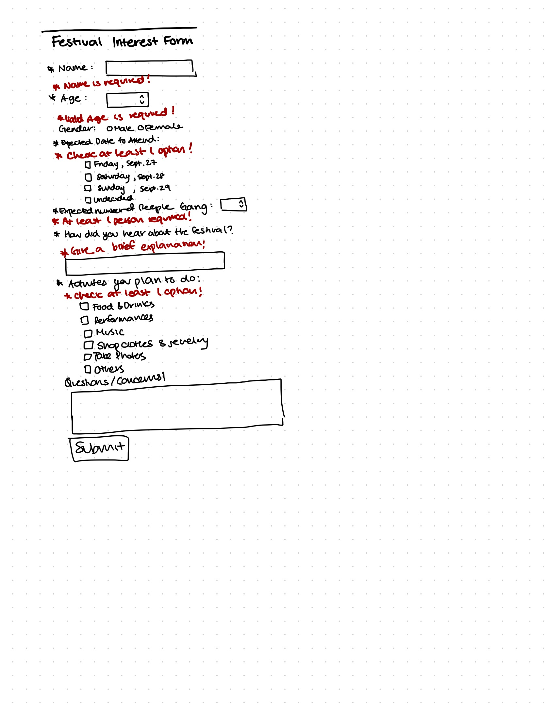
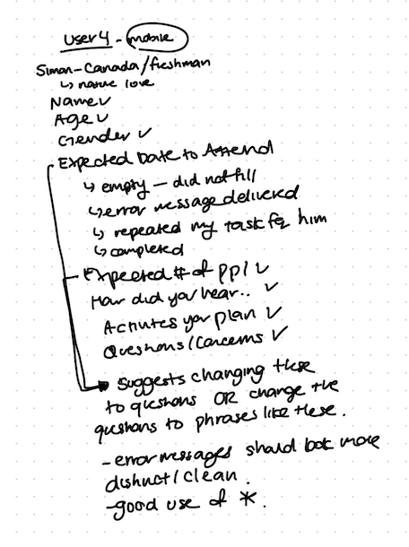
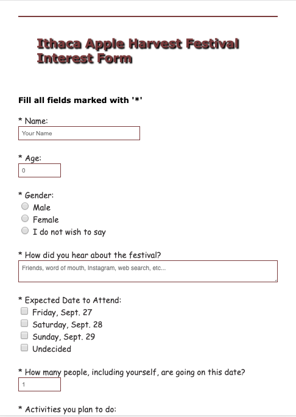

# Project 3 - Design Journey

Be clear and concise in your writing. Bullets points are acceptable.

## Planning, Design, & Evaluation

### Target Audience (Milestone 1)
> Who is your site's target audience? This should be the original target audience from Project 1 or Project 2.

My target audience for this project is Cornell students who have not been to Ithaca Apple Harvest festival (i.e. mainly Freshmen, Transfer students). This is the same target audience as my Project 2. I want my website to be an informative website, presenting information that new students are wondering about at Apple Harvest festival. I want this to be a personal website, so I want to use the form as an opportunity to learn more about my audience and the important things they want to know about.

### Planning & Designing for User Input (Milestone 1)
> Determine what purpose the form for your site will accomplish, where it will go (physical placement on page and the HTML file name), and what form components you plan on using.

Purpose:
Interest form: I want to gather audience's interests in the festival as a form of data collection. My target audience are students who have never been to the festival. Hence, I will gather data on when they plan to go, what activities they look forward to, any questions or concerns they have that may help me improve my website (FAQ page). This form will also allow users to plan better for the upcoming festival. I may use the data to update the information given on my website.

Location:
I was debating between putting the form on the front page where most people will see or putting the form on the FAQ page so it connects with my purpose. I eventually decided to put it on the bottom of the FAQ page, because I wanted to make sure the users have time to look through the website and get information on the festival before submitting the form. I believe that my form will require the users to know more about the festival. Also, I think having it below the FAQ pages allow users to ask unanswered questions they have that I might be able to add to the FAQ page.


Form Components:
  - Name: text field; `<input>`
  - Age: number field; `<input type="number" placeholder="0" step="1" min="0" max="125">`
  - Gender: radio; `<input type="radio">`
  - Expected date: date and time picker; `<input type="checkbox">`
  - Expected number of people going; number field; `<input type="number" placeholder="1" step="1" min="1">`
  - How they heard about the festival; `<textarea cols="20" rows="10"></textarea>`
  - Activities they plan to do: checkbox; `<input type="checkbox">`
  - Questions or Concerns: Multi-line text fields; `<textarea cols="30" rows="20"></textarea>`


> Include sketches on your form below. Include sketches of your **mobile and desktop** versions.

**Desktop Sketches**


**Mobile Sketches**


> What submission method will your form use? GET or POST. Explain your reasoning.

I will use GET, because I believe that the information I get from the form is more of data and trend survey. Therefore, it is not a private data and is okay to be sent to the server multiple times.

### Determine the Form Validation Criteria (Milestone 1)
> For each control in your form, specify the validation criteria AND your reasoning behind the criteria.

- Name
  - reasoning: Name is required because users must be differentiable and identifiable.
  - required/optional: `required`
  - constraints: none (name can be anything)

- Age
    - reasoning: Age is required because I need user information to gather data. Can't have negative ages. Oldest human was 122.
    - required/optional: `required`
    - constraints: `min="0" max="125"`

- Gender
    - reasoning: Gender is optional because some people do not feel comfortable disclosing the information to others. However, I think it's a good way to know more about the user.
    - required/optional: optional
    - constraints: `female` `male`

- Expected date
    - reasoning: Date is required because I get a better idea of when users would likely to go. They can chose undecided if they are unsure when to attend.
    - required/optional: `required`
    - constraints: `Friday`, `Sept. 27` ; `Saturday, Sept. 28`; `Sunday, Sept. 29`; `Undecided`

- Expected number of people going
    - reasoning: required because it gives a measure of how people tend to go to the festival. Good data collection.
    - `required`
    - constraints: `min=1`, numbers only

- How they heard about the festival
    - reasoning: required because I want to know how new students become aware of the festival and what the best way to reach out to new people is.
    -  `required`
    - constraints: none

- Expected activities
    - reasoning: List of activities planned is required because we can get better idea of what is popular and what people like about the festival.
    - required/optional: `required`
    - constraints: `Eating Food`; `Trying drinks`; `taking pictures`; `listening to live music`; `watching performances, etc.`

- Questions or Concerns
    - reasoning: optional because some people may not have question or concern.
    - required/optional: `optional`
    - constraints: none

### Design Form Feedback (Milestone 1)
> Include sketches of your **mobile and desktop** _feedback_.

**Desktop Feedback**


**Mobile Feedback**


### User Testing Plan (Milestone 1)
> Plan out your **one** task to evaluate your form.

Task: Submit an interest form, showing what your interests are and what you plan to do at the festival. Use the information:
You only have time to go to the festival on a Friday and you want to go with your 3 best friends. You heard about the festival through word of mouth and you plan to eat the food there. You are wondering how much cash to bring for the food.

### User 1 - Testing Notes (Milestone 1)
> When conducting user testing, you should take notes during the test. Place your notes here.


### User 1 (Milestone 1)
> Using your notes from above, describe your user 1 by answering the questions below.

1. Who is your user 1, e.g., where user 1 comes from, what is your user 1’s job, characteristics, etc.?
User 1 is a freshman at Cornell from South Korea. She is an engineer and she is interested in going to the next festival.

2. Does your user 1 belong to your target audience of the site? (Yes / No)
Yes

> If “No”, what’s your strategy of associating the user test results to your target audience’s needs and wants? How can your re-design choices based on the user tests make a better fit for the target audience?


### User 1 - **Desktop** (Milestone 1)
> Report the results of your user 1 evaluation. You should explain **what the user did**, describe the user's **reaction/feedback** to the design, **reflect on the user's performance**, determine what **re-design choices** you will make. You can also add any additional comments. See the example design journey for an example of what this would look like.

- **Did you evaluate the desktop or mobile design?**
  - mobile
- **How did the user do? Did they meet your expectation?**
  - User was able to complete the task. However, she noted that the design in the mobile version does not allow for a lot of space for the multi-text fields.
- **User’s reaction / feedback to the design** (e.g., specific problems or issues found in the tasks)
  - The user did not have specific problems. She just noted that it may be more visually appealing if there was more space.
  - She also commented that the submit button is better to have it on the right side.
- **Your reflections about the user’s performance to the task**
  - I think I do need more whitespace between the texts inside the form. Overall, I am satisfied with the way the user test went.
- **Re-design choices**
  - I will add more space between the texts in the form.
  - I will change the location of the submit button.
- **Additional Notes**
  - I want my form to look as clean as possible and as visually appealing as possible.


### User 2 - Testing Notes (Milestone 1)
> When conducting user testing, you should take notes during the test. Place your notes here.


### User 2 (Milestone 1)
> Using your notes from above, describe your user 2 by answering the questions below.

1. Who is your user 2, e.g., where user 2 comes from, what is your user 2’s job, characteristics, etc.?

User 2 is a sophomore transfer from California. She is an undecided major and she has a very bubbly and a curious personality.

2. Does your user 2 belong to your target audience of the site? (Yes / No)

Yes.

> If “No”, what’s your strategy of associating the user test results to your target audience’s needs and wants? How can your re-design choices based on the user tests make a better fit for the target audience?


### User 2 - **Mobile** (Milestone 1)
> Report the results of your user 2 evaluation. You should explain **what the user did**, describe the user's **reaction/feedback** to the design, **reflect on the user's performance**, determine what **re-design choices** you will make. You can also add any additional comments. See the example design journey for an example of what this would look like.

- **Did you evaluate the desktop or mobile design?**
  - desktop
- **How did the user do? Did they meet your expectation?**
  - User met my expectations. The user did very well in completing the task.
- **User’s reaction / feedback to the design** (e.g., specific problems or issues found in the tasks)
  - User was able to complete the task very easily; However, she noted that there seemed to be too big of a space for the "how did you hear about the festival" portion.
  - User also talked about how the order of the questions are a bit weird.
- **Your reflections about the user’s performance to the task**
  - I really liked the response I got from the user testing. I see the importance in both logical flow and design in forms for it to be usable.
- **Re-design choices**
  - I will implement the changes of the ordering of the form as well as to change the size of the multi-text fields.


### Design Changes (Milestone 1)
> Use the space provided here to document any design changes from testing.

I will first change the ordering of the questions asked in the form, because I think the user 2 was right about how the ordering seems to be strange and inconvenient for users.

I will change the whitespace in between each question to make sure there is space so that it is visually appealing.

I will change the location of the submit button from left to right side of the form.


### Additional Information (Milestone 1)
> (optional) Include any additional information, justifications, or comments we should be aware of.


---

## Polished & Tested Form

###  Plan Validation Pseudocode (Final Submission)
> Write your form validation pseudocode here.

```
When the user tries to submit the form:
  If the name's HTML5 validation criteria has not been met:
     Show a feedback message to "* Name field required!"
        Do not submit the form.
  If the Age's HTML5 validation criteria has not been met:
    Show a feedback message to "*Age needs to be at least 0!"
        Do not submit the form.
  If the Gender's HTML5 validation criteria has not been met:
    Show a feedback message to "*Please select one option!"
        Do not submit the form.
  If the How did you hear about the festival's HTML5 validation criteria has not been met:
    Show a feedback message to "* Please write a valid answer!"
        Do not submit the form.
  If the Expected Date to Attend's HTML5 validation criteria has not been met:
    Show a feedback message to "* Please check at least one option!"
        Do not submit the form.
  If the Expected Number of People Going's HTML5 validation criteria has not been met:
    Show a feedback message to "* At least one person is required! Remember to count yourself!"
        Do not submit the form.
  If the Activities Planned's HTML5 validation criteria has not been met:
    Show a feedback message to "* Please check at least one option!"
        Do not submit the form.
  Otherwise,
    Show no feedback message. Submit the form to the server.
```

### User Testing Plan (Final Submission)
> This should probably be the same task from your first round of testing unless you have a reason to change it.

Task: Submit an interest form, showing what your interests are and what you plan to do at the festival. Use the information:
You only have time to go to the festival on a Friday and you want to go with your 3 best friends. You heard about the festival through word of mouth and you plan to eat the food there. You are wondering how much cash to bring for the food.


### User 3 - Testing Notes (Final Submission)
> When conducting user testing, you should take notes during the test. Place your notes here.


### User 3 (Final Submission)
> Using your notes from above, describe your user 3 by answering the questions below.

1. Who is your user 3, e.g., where user 3 comes from, what is your user 3’s job, characteristics, etc.?

User 3 is a freshman from California. She is an Engineering student, studying Information Science. She likes to try new things and is down to try new things and explore.

2. Does your user 3 belong to your target audience of the site? (Yes / No)

Yes.

> If “No”, what’s your strategy of associating the user test results to your target audience’s needs and wants? How can your re-design choices based on the user tests make a better fit for the target audience?


### User 3 - **Desktop** (Final Submission)
> Report the results of your user 3 evaluation. You should explain **what the user did**, describe the user's **reaction/feedback** to the design, **reflect on the user's performance**, determine what **re-design choices** you will make. You can also add any additional comments. See the example design journey for an example of what this would look like.

- **Did you evaluate the desktop or mobile design?**
  - desktop
- **How did the user do? Did they meet your expectation?**
  - User did well. She was able to write in all the given information into its appropriate areas.
- **User’s reaction / feedback to the design** (e.g., specific problems or issues found in the tasks)
  - User stumbled upon the expected number of people going. Since I told her that she "wants to go with her 3 best friends", she thought for a moment whether to put 3 or 4. Ultimately, she did well by putting 4 (counted herself).
  - Design wise, she was liked that the form was stacked and said it was easy to follow. She said the questions were also easy to interpret. She was able to fill out all the information, so she did not see the error messages. As for the form, she suggested adding similar color schemes from the website so that the form would be a better "add-on" to the website.
- **Your reflections about the user’s performance to the task**
  - I am glad that this user was able to complete the task sucessfully. I agree with her feedback.
- **Re-design choices**
  - I will be changing the color of the input boxes so that it matches the red, brown, pink color scheme I have for the overall website.
- **Additional Notes**
  - I realized the importance of not only the functions but also the aesthetics of the website. Users catch on to these things easily.


### User 4 - Testing Notes (Final Submission)
> When conducting user testing, you should take notes during the test. Place your notes here.



### User 4 (Final Submission)
> Using your notes from above, describe your user 4 by answering the questions below.

1. Who is your user 4, e.g., where user 4 comes from, what is your user 4’s job, characteristics, etc.?

User 4 is a freshman boy from British Columbia, Canada. He was raised in a rural area so he loves nature and to go outside and explore.

2. Does your user 4 belong to your target audience of the site? (Yes / No)

Yes.

> If “No”, what’s your strategy of associating the user test results to your target audience’s needs and wants? How can your re-design choices based on the user tests make a better fit for the target audience?


### User 4 - **Mobile** (Final Submission)
> Report the results of your user 4 evaluation. You should explain **what the user did**, describe the user's **reaction/feedback** to the design, **reflect on the user's performance**, determine what **re-design choices** you will make. You can also add any additional comments. See the example design journey for an example of what this would look like.

- **Did you evaluate the desktop or mobile design?**
  - mobile
- **How did the user do? Did they meet your expectation?**
  - User did well with the task. He met my expectations.
- **User’s reaction / feedback to the design** (e.g., specific problems or issues found in the tasks)
  - The user misinterpreted the task and did not fill out the "Expected date to attend" section and got an error message.
  - User said he thinks the question should be somewhat more consistent. So if one question was a question, the others should. If one question was a statement, the others should also. So he suggested I do one or the other.
  - He also suggested making the error message more distinct from the other texts. He liked the asterisks used, but he suggested I add a little more to the design implementation.
- **Your reflections about the user’s performance to the task**
  - I really like the feedback I got. I realized the importance of consistency so that the users have an easier time filling out the form.
- **Re-design choices**
  - I will change the wording of the labels into questions, because I feel like this is easier to understand rather than "Expected date to attend". This phrase also feels too formal for my "friendly" website.
  - I will also add a border or a line for the error message to make it more distinct for all users, including the color blind.


### Design Changes (Final Submission)
> Use the space provided here to document any design changes from testing.

From the user testing I did for the final submission, I got very good feedback. I think partly because users were able to physically type in their inputs and get the outcome from it.

From the feedback, I realized I need to change several things. First, I will be changing the color of the input boxes so that it matches the color theme I have for the overall website. A user had pointed out that the form feels too detached from the overall website, and color might help solve that issue. I really liked this feedback because I learned that aesthetics matter a lot for users to actually want to use the form. Second, I will change the phrased wording of the labels into questions. For example, I have one question as "How did you hear about the festival?". Other phrases I have are "Expected Date to Attend", which I think feels more formal and uninteractive. Therefore, I will change all the phrases into questions. I will change "Expected Date to Attend" into "When do you plan on going?" and "Expected number of People Going" to "How many people are going on this date?" and "Activities you plan to do" to "What activities are you going to be doing?" Finally, I will add a thick line in front of each error message so that users, including the color blind, to see the distinct messages for each error they receive. Not only will this line make the error messages more distinct, but I think it will also help with the clean look of the overall form.


Before Screenshots (desktop):


Feedback


After screenshots with changes (desktop):


Feedback


Mobile:




Feedback


### Additional Design Justifications (Final Submission)
> If you feel like you haven’t fully explained your design choices in the final submission, or you want to explain some functions in your site (e.g., if you feel like you make a special design choice which might not meet the final requirement), you can use the additional design justifications to justify your design choices. Remember, this is place for you to justify your design choices which you haven’t covered in the design journey. Use it wisely. However, you don’t need to fill out this section if you think all design choices have been well explained in the final submission design journey.

I decided to make the gender a required radio button, because I realized while trying it myself, that when you click one radio button, you are unable to UNclick. Therefore, a user would have to refresh the page if they do not wish to disclose their gender. Therefore, to make things easier for the users, I decided to add one more option stating "I do not wish to say", so if they accidentally click on one option, they have the option to not disclose their gender. I made this choice as a designer, realizing that this would be more efficient for the users. While user testing, I also found that users were able to easily switch from one option to the other.

I made different sized boxes for each input, for example the ones with type="number" have a lot smaller boxes compared to the multi-line text fields (textareas). This is because component "name", "age", or "Questions/Concerns" all require different sizes in their answers.

I chose to make the error messages bolded, which creates more distinction between the regular texts and is easily noticeable even by the color blind people. I did an informal testing with a friend who is color blind to see whether they were able to clearly notice the error messages.

I also left the questions/concerns component unrequired, because I felt that not everyone would want to ask a question if the website already covered their questions/concerns.

In the form, you can notice that layout is changed from desktop to mobile. Some of these changes include how the inputs needing numerical values are aligned in one line for "Age" and "Expected Number of People Going" in the desktop version. In the mobile version, the input and the label are stacked in a column. Because of these changes, I had to make sure the location of the error messages were changed accordingly. In the desktop version, I made sure the error messages were shown under the line where "age" and its input box are. In the mobile version, I changed the location of the error message to underneath the label but above the input box (since they are in a column in the mobile version). This is because I wanted the design to be consistent with other labels in the mobile version. Other labels in the mobile version have error messages underneath the labels and above the input boxes.

The radio buttons are also in a row for the desktop version but are in columns for the mobile version. The mobile version also has padding on both sides of the form, making the form a bit more centered; in contrast, the desktop version sticks to the left side of the window screen.


### Self-Reflection (Final Submission)
> This was the first project in this class where you coded some JavaScript. What did you learn from this experience?

I really enjoyed learning about how JavaScript works. It felt more similar to what I learned in Python and Java with if-statements. I really enjoyed how logical it was. For example when the if statement was true, A would be performed, when the if statement was false, B would be performed. At first, I had trouble with the ID names and how it worked. But using `console.log()`, I was able to learn more about debugging and then learning how ID's and javascript work.

> Take some time here to reflect on how much you've learned since you started this class. It's often easy to ignore our own progress. Take a moment and think about your accomplishments in this class. Hopefully you'll recognize that you've accomplished a lot and that you should be very proud of those accomplishments!

I was not a big fan of coding or programming when the course had started. However, after learning and actually understanding the logic behind the code, I am really loving learning about HTMl, CSS, and Javascript, and how they all come together to form a usable website. I feel proud of myself for being able to understand the code I am writing and actually implementing them so that I can test it on my peers and get critical feedback.

I want to get more practice with Javascript, HTML and CSS by maybe creating more websites on my own time and testing it out to see how other people might find it useful.
